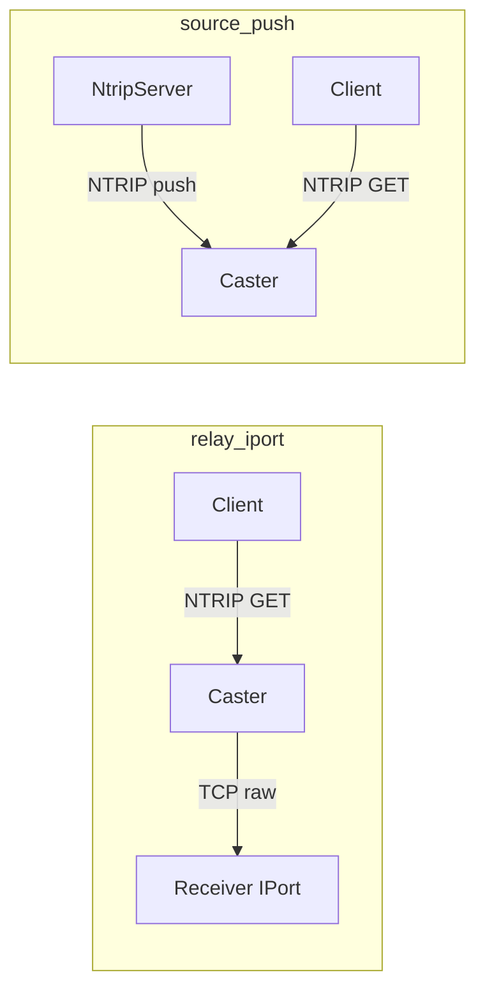
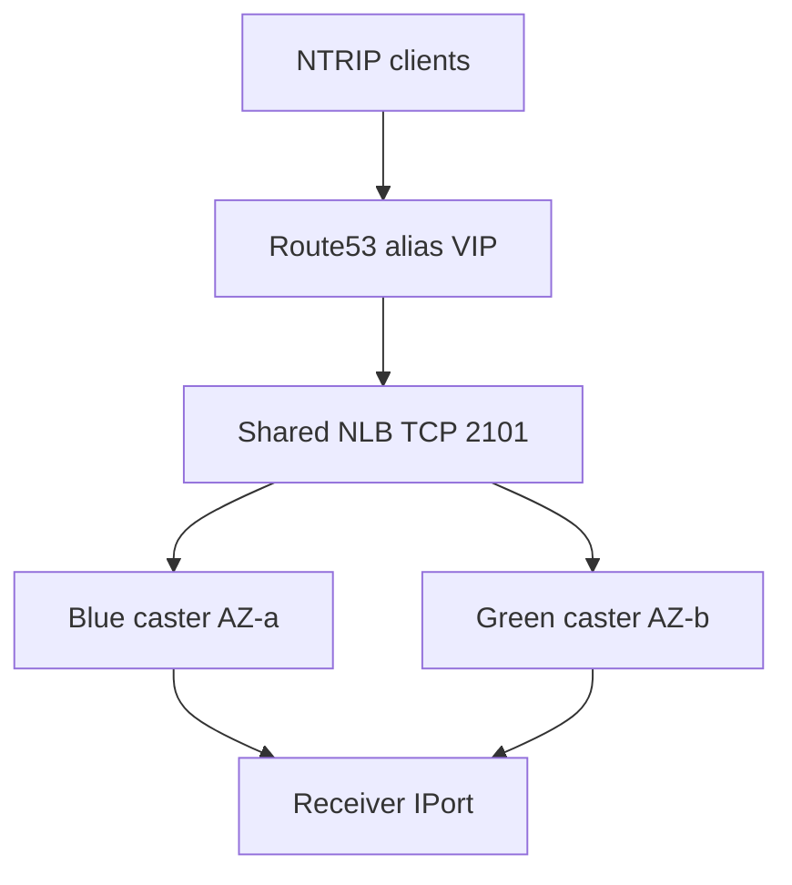
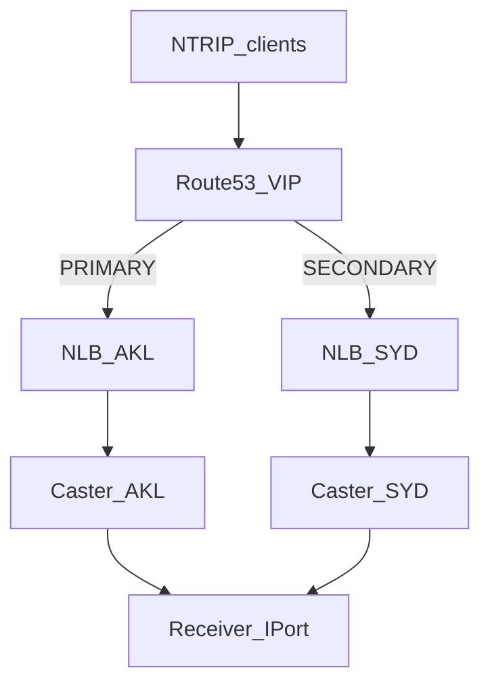

# NTRIP architecture

Reusable module: `modules/caster`. Deploy from an **example** folder — do not
edit conf templates to switch ingest mode.

| Example | Diagram |
| ------- | ------- |
| [`examples/relay_iport`](examples/relay_iport/) | [guide/diagrams/relay-iport.drawio](guide/diagrams/relay-iport.drawio) |
| [`examples/source_push`](examples/source_push/) | [guide/diagrams/source-push.drawio](guide/diagrams/source-push.drawio) |
| [`examples/relay_iport_ha`](examples/relay_iport_ha/) | [guide/diagrams/relay-iport-ha.drawio](guide/diagrams/relay-iport-ha.drawio) |
| [`examples/relay_iport_ha_mr`](examples/relay_iport_ha_mr/) | [guide/diagrams/relay-iport-ha-mr.drawio](guide/diagrams/relay-iport-ha-mr.drawio) |

HA failover detail: [guide/FAILOVER.md](guide/FAILOVER.md) ·
[dual-AZ](guide/diagrams/relay-iport-ha-failover.drawio) ·
[multi-region](guide/diagrams/relay-iport-ha-mr-failover.drawio).

The module runs **BKG Professional NtripCaster** as a private EC2 on TCP **2101**.

**`relay_iport`** is a caster-side relay pull of a raw TCP IPort stream, not an
NtripServer **push**. Use **`source_push`** for upload-based ingest.

References: [NTRIP overview (BKG)](https://igs.bkg.bund.de/ntrip/),
[Ntrip documentation (PDF)](https://igs.bkg.bund.de/root_ftp/NTRIP/documentation/NtripDocumentation.pdf),
[BKG Professional NtripCaster manual](https://igs.bkg.bund.de/root_ftp/NTRIP/documentation/ntripcaster_manual.html).

---

## Roles

NTRIP (Networked Transport of RTCM via Internet Protocol) is HTTP-based streaming
of GNSS data (usually RTCM). Four named roles:

| Role | What it is | HTTP role |
| ------ | ------------ | ----------- |
| **NtripSource** | GNSS receiver / generator of a stream | — |
| **NtripServer** | Forwards that stream **to** a caster (upload) | HTTP **client** |
| **NtripCaster** | Splits one incoming stream to many listeners | HTTP **server** |
| **NtripClient** | Pulls a stream **from** a caster (download) | HTTP **client** |

The caster does **not** decode RTCM and does **not** do VRS / nearest-base selection.

Ntrip **v1** uses a non-HTTP `SOURCE` upload and a shared `encoder_password`.
Ntrip **v2** is HTTP-compatible, uses per-user auth for uploads, and optionally
TLS (`-s`).

---

## Ingest modes

| Mode | Who opens the socket | Config | Module support |
| ------ | ---------------------- | -------- | ---------------- |
| **Ntrip v1 source push** | Receiver connects **in** to caster `:2101` | `SOURCE` + `encoder_password` | Not used (password rotated away from stock defaults) |
| **Ntrip v2 source push** | Same, HTTP POST | `users.aut` + `groups.aut` + `sourcemounts.aut` | **`source_push`** |
| **Relay pull from another caster** | This caster connects **out** | `relay pull -2 -i user:pass -m /LOCAL remote:2101/REMOTE` | Not wired in examples |
| **Relay pull raw TCP (IPort)** | This caster connects **out** to `IP:port` | `relay pull -m /LOCAL IP:port -2` | **`relay_iport`** (+ HA) |
| **Alias** | Local rename or on-demand remote | `alias ...` | Not used |

Raw IPort is a GNSS receiver listening on TCP and dumping RTCM (commonly port
**8857**). There is no NTRIP handshake on that port. The caster is the client;
the receiver does not need the caster IP.

```plaintext
  Ntrip v1/v2 PUSH (source_push)
  Receiver --SOURCE/POST--> Caster:2101 --GET--> Client

  RELAY PULL of IPort (relay_iport)
  Caster --TCP raw RTCM--> Receiver:8857
  Client --NTRIP GET--> Caster:2101/MOUNT
```



---

## Deployed shape (single caster)

```plaintext
                    VPC (private subnet, no public IP)
  +----------------------+          +----------------------------------+
  | GNSS receiver         |          | EC2  ntripcaster                 |
  | IPort or NtripServer |  ingest  | BKG NtripCaster                  |
  |                      |<-------->| listen 0.0.0.0:2101              |
  +----------------------+          +------------------+---------------+
                                                       |
                          Ntrip v2 GET /MOUNT          |
                          authenticated client         v
                                    +------------------+---------------+
                                    | NtripClient (BNC, curl, rover)   |
                                    | via VPN / SSM / NLB              |
                                    +----------------------------------+
```

| Item | Typical value |
| ------ | --------------- |
| Caster | BKG Professional NtripCaster on AL2023 |
| Listen | TCP **2101** |
| Ingest | `field_sources` (`relay_iport`) or `push_sources` (`source_push`) |
| Client protocol | Ntrip **v2** |
| Client auth | `users.aut` → group `clients` → `clientmounts.aut` |
| Network | Private IP; SSM for shell / port-forward |
| NLB | Optional on single-node examples (`enable_nlb`); **required shared** on HA |

Conf files are rendered from `modules/caster/templates/*.tftpl` and delivered by
userdata. With `user_data_replace_on_change` off, changing relay inventory needs
an **instance replace**.

---

## High availability (single region)

Two warm casters (blue / green) in different AZs share **one** internal NLB.
Clients dial a Route 53 **alias** VIP. Failover is L4 target health (~20s), not
DNS PRIMARY/SECONDARY. Clients must reconnect; expect ~20–40s of missing stream
data.

See [guide/FAILOVER.md](guide/FAILOVER.md) and
[`examples/relay_iport_ha`](examples/relay_iport_ha/).



## High availability (multi-region)

One caster + NLB per region (`ap-southeast-6` PRIMARY, `ap-southeast-2`
SECONDARY). Same VIP via Route53 failover aliases (`evaluate_target_health`).
Dual-account profiles are supported; zone/VIP records stay in Sydney. Gaps are
typically **1–3+ minutes** (DNS-dominated); keep regional NLBs. See
[guide/FAILOVER.md](guide/FAILOVER.md) and
[`examples/relay_iport_ha_mr`](examples/relay_iport_ha_mr/).



---

## Client egress

| Mode | Config |
| ------ | -------- |
| Open mount | Mount **absent** from `clientmounts.aut` |
| Authenticated GET | `/MOUNT:group` in `clientmounts.aut` |
| Admin web | `/admin:admins`, `/oper:admins` |

Sourcetable (`sourcetable.dat`) is **dynamic**: a client GET of `/` only lists
STRs that are **online**.

Example pull (on-box or via port-forward):

```bash
curl -sS -u 'client:PASSWORD' -H 'Ntrip-Version: Ntrip/2.0' \
  http://127.0.0.1:2101/EXMP00XXX0 -o raw.rtcm
```

---

## Conf files (BKG)

| File | Role | Values from |
| ------ | ------ | ------------- |
| `ntripcaster.conf` | Identity, port, limits, ACL, relays, passwords | module vars + `random_password` |
| `sourcetable.dat` | CAS / NET / STR inventory | `field_sources` / `push_sources` |
| `users.aut` / `groups.aut` | Admin + client (+ push) users | `admin_*` / `ntrip_*` |
| `clientmounts.aut` | Mount ACLs for clients / admin | inventory |
| `sourcemounts.aut` | Upload ACLs (`source_push`) | `push_sources` |

`server_name` and the sourcetable `CAS` host are rewritten at bootstrap to
`caster_server_name`, or the instance private IP when empty.

---

## Load balancer

Layer 4 is required: NTRIP streams are long-lived and Ntrip v1 is not
HTTP-compliant, so an ALB breaks them. Health checks are **TCP**.

```plaintext
  Clients ──TCP 2101──> NLB ──TCP 2101──> caster(s)
                          source IP preserved
```

Instance targets preserve client source IP, so instance SG and caster
`allow client` ACL still see real client addresses. Set `caster_server_name` to
the NLB DNS name (single-node) or the Route 53 VIP FQDN (HA).

## Out of scope

TLS termination on the caster, VRS / nearest-base, multi-region **active-active**
(latency/weighted), Puppet. Optional BNC client for HA drills is
[`modules/bnc_client`](modules/bnc_client/).
