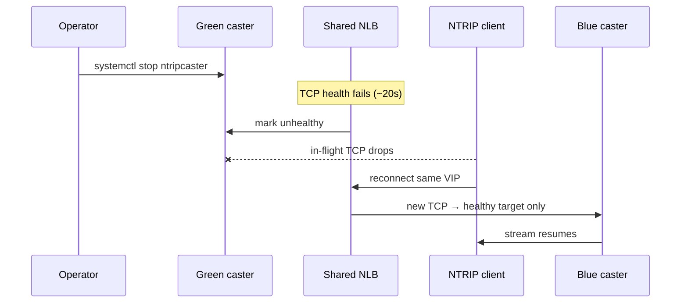
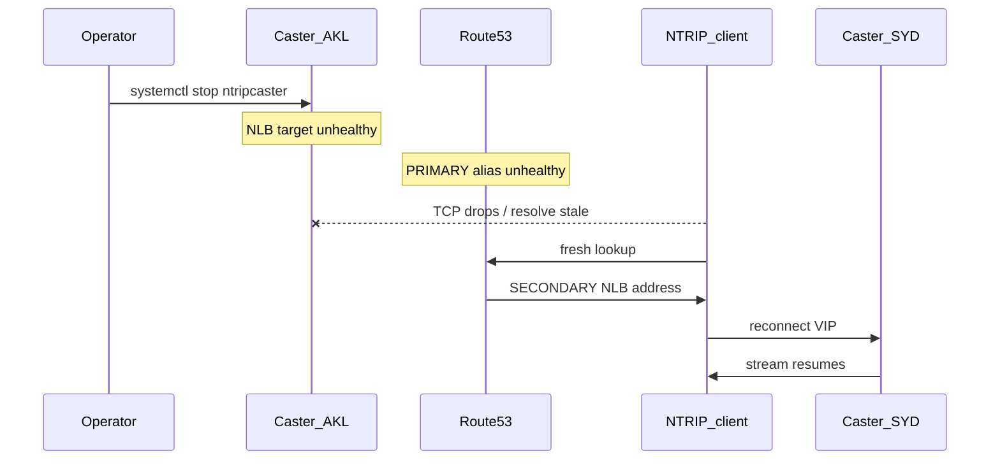

# Failover

Two HA examples:

| Example | Scope | Mechanism |
| ------- | ----- | --------- |
| [`examples/relay_iport_ha`](../examples/relay_iport_ha/) | Single-region dual-AZ | Shared NLB L4 health (~20–40s) |
| [`examples/relay_iport_ha_mr`](../examples/relay_iport_ha_mr/) | AKL↔SYD, one host/region | Route53 failover aliases (DNS) |

Neither is zero-disconnect streaming.

---

## Single-region blue/green

Single-region blue/green HA lives in [`examples/relay_iport_ha`](../examples/relay_iport_ha/).

## Steady state

```plaintext
Clients ──► Route53 alias VIP ──► shared internal NLB ──► blue + green EC2
                                              │
                         both casters ──relay pull──► Receiver IPort
```

| Piece | Role |
| ----- | ---- |
| Route 53 | Simple **A alias** to the NLB DNS name (stable VIP FQDN) |
| Shared NLB | One TG; both instances attached; TCP `:2101` |
| Health | Interval **10s**, unhealthy threshold **2** → ~**20s** to mark down |
| Stickiness | Source-IP (optional); new flows can land on either healthy target |
| Blue / green | Warm casters in different AZs; each independently relay-pulls the IPort |

Diagrams: [relay-iport-ha.drawio](diagrams/relay-iport-ha.drawio) ·
[relay-iport-ha-failover.drawio](diagrams/relay-iport-ha-failover.drawio)

## What happens on drain



1. Stop (or lose) one caster — e.g. `./scripts/failover.sh drain-green`.
2. NLB TCP health fails after ~20s; that target leaves the rotation.
3. In-flight client TCP on the drained node **drops**.
4. Clients **must reconnect** to the **same** VIP FQDN.
5. New connections go only to the remaining healthy caster.

VIP / Route 53 record does **not** change.

## Expected data gap

| Metric | Typical |
| ------ | ------- |
| NLB detection | ~20s |
| Client reconnect + retries | a few more seconds |
| Total missing 1 Hz epochs | **~20–40s** (~**34s** measured with BNC) |

Acceptable for post-processed RINEX / QC. RTK rovers will notice a short drop.
Not enough for continuous fixed / safety-critical without a hotter path.

`rinex-tools check` validates RINEX **structure** only — scan epoch times for gaps.

## Drill

```bash
cd examples/relay_iport_ha
./scripts/failover.sh status
./scripts/failover.sh drain-green   # or drain-blue
# wait ~25s, confirm TG: one unhealthy, one healthy
./scripts/failover.sh restore-green
```

Optional BNC client (`enable_client = true`) pulls the VIP and writes 15‑minute
RINEX 3 under `/opt/bnc/rnx` for gap measurement. See the example README.

## What this is not (single-region)

- Seamless mid-stream handoff (no connection migration)
- Dual admin ALB / dual NLB per side (this example uses one shared NLB)

Cross-region DNS failover is a separate example — see below.

---

## Multi-region (one instance per region)

Lives in [`examples/relay_iport_ha_mr`](../examples/relay_iport_ha_mr/).
**PRIMARY** `ap-southeast-6` (Auckland), **SECONDARY** `ap-southeast-2` (Sydney).
One caster + internal NLB in each region; same VIP FQDN.

Often **two AWS accounts**: Auckland (`primary_aws_profile`) and Sydney
(`secondary_aws_profile`). Private hosted zone and VIP records live in the
**Sydney** account; casters/NLBs use their regional profiles. Cross-account
alias to the PRIMARY NLB is supported.

```plaintext
Clients ──► Route53 VIP (failover aliases)
              ├─ PRIMARY  → NLB AKL → caster AKL
              └─ SECONDARY → NLB SYD → caster SYD
Both ──relay pull──► Receiver IPort
```

| Piece | Role |
| ----- | ---- |
| Route 53 | Failover **A aliases** with `evaluate_target_health` |
| Per region | One EC2 + module-owned NLB (`enable_nlb=true`) |
| Failover | DNS only — when PRIMARY NLB has no healthy targets, SECONDARY is served |
| Instance type | Default `m6i.large` (`ap-southeast-6` has no `m6a`) |
| Provider | AWS provider `>= 6.13.0` (NZ region) |

Diagrams: [relay-iport-ha-mr.drawio](diagrams/relay-iport-ha-mr.drawio) ·
[relay-iport-ha-mr-failover.drawio](diagrams/relay-iport-ha-mr-failover.drawio)



### Why keep the NLB

Recovery is **longer** than dual-AZ L4 mainly because of **DNS** (failover +
resolver cache), not because of the load balancer. Keep the regional NLB:

- Stable VIP / alias target with `evaluate_target_health`
- Instance replace without rewriting DNS
- Works for private clients and cross-account PRIMARY aliases

Removing the NLB (A record → instance IP) does not remove DNS delay and makes
private health checks awkward. Prefer shorter TG thresholds or client DNS
refresh if you need faster recovery — not dropping the NLB.

### Expected gap (cross-region)

| Stage | Typical |
| ----- | ------- |
| NLB unhealthy | ~20s |
| Route53 failover | tens of seconds |
| DNS TTL / resolver cache | often dominates |
| Client reconnect | seconds |

Total often **1–3+ minutes** (longer than dual-AZ ~20–40s / ~34s measured).
Acceptable for post-processed RINEX; RTK will notice a longer drop.

### RINEX / BNC

BNC runs in **PRIMARY** (Auckland). After ~15 min of data:

```bash
# on the BNC instance — structure only
sudo docker run --rm -v /opt/bnc/rnx:/data:ro \
  ghcr.io/platformfuzz/gnss-rinex-tools-image:latest \
  check /data/<file.rnx>
```

`rinex-tools check` does **not** report time gaps — scan 1 Hz epochs in the
file that covers the drain. Full SSM steps: example README.

### Drill

```bash
cd examples/relay_iport_ha_mr
# SSO both profiles first
./scripts/failover.sh status
./scripts/failover.sh drain-primary
# confirm primary TG unhealthy; clients may need DNS refresh to hit secondary
./scripts/failover.sh restore-primary
```
